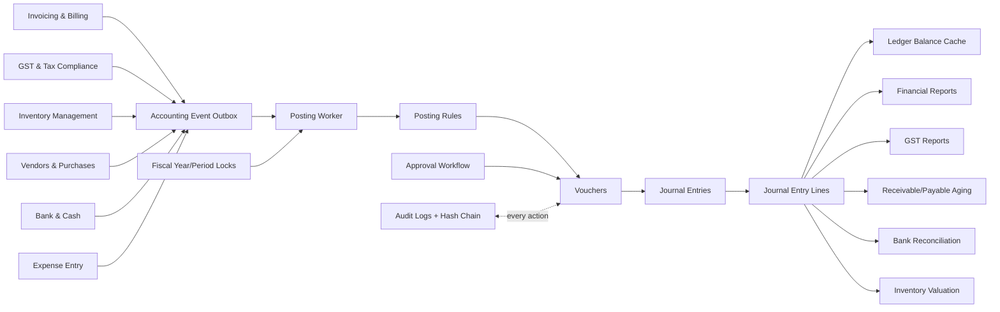

# Accounting & Finance Module Architecture

This document designs the enterprise Accounting & Finance module for AccuDocs. It assumes PostgreSQL, the existing modular backend structure, and the current GST, billing, inventory, vendor, and sub-ledger modules. The accounting module becomes the financial source of truth: every business event posts a balanced journal entry, and all statutory and financial reports are derived from posted journals.

The concrete SQL schema proposal is implemented in `database/migrations/016_accounting_finance_schema.sql`.

## 1. High-Level Architecture

Core principles:

- Double-entry accounting: every posted transaction has debit total equal to credit total.
- Journal-based source of truth: financial reports read from `journal_entries` and `journal_entry_lines`, not invoice/payment totals.
- Immutable accounting history: posted journals are never hard-deleted; corrections use reversal entries.
- Event-driven posting: source modules publish accounting events to a transactional outbox.
- Audit-safe workflow: all approval, posting, reversal, reconciliation, lock, and close actions are logged.
- Multi-tenant, multi-company, multi-branch: all financial tables are scoped by `organization_id`, with optional `branch_id` and `cost_center_id`.
- Period control: fiscal years and periods can be soft locked or hard locked.

Logical layers:

1. Source modules: Billing, GST, Inventory, Vendors, Payments, Bank, Expense.
2. Accounting command layer: validates source documents, approvals, locks, idempotency, and posting rules.
3. Posting engine: converts source events into vouchers, journal entries, journal lines, ledger balances, and audit records.
4. Ledger store: chart of accounts, journal entries, journal lines, ledger balance cache.
5. Reporting engine: trial balance, general ledger, P&L, balance sheet, cash flow, GST, aging, bank reconciliation.
6. Governance layer: RBAC, approval workflow, audit logs, fiscal locks, close workflow.

## 2. Module Interconnection Diagram



Interconnection rule: source documents may display their own totals, status, and workflow state, but the financial ledger balance and statutory report amount must be derived from posted journal lines.

Multi-company and multi-branch handling:

- `organization_id` represents the legal/company accounting boundary.
- `branch_id` represents GST registration/place-of-business reporting and branch financial reporting.
- Inter-branch movement uses branch clearing accounts unless the branch is only a warehouse/location dimension.
- Inter-company movement is never a stock transfer; it creates a sale in one company and purchase in the other.
- Consolidation is a reporting layer above company ledgers with elimination journals for inter-company balances.
- Cost centers are analytical dimensions and must not replace legal branch or company accounting.

## 3. Database Design

The migration `016_accounting_finance_schema.sql` adds or hardens these tables:

| Table | Purpose |
| --- | --- |
| `branches` | GST branch/place of business accounting scope. |
| `cost_centers` | Department/project/product/customer profitability tracking. |
| `fiscal_years` | Fiscal year, open/lock/close state, close snapshots. |
| `account_groups` | Hierarchical account grouping for reports. |
| `accounts` | Chart of accounts with control account metadata. |
| `customers` | Accounting profile that maps existing `clients` to receivable accounts. |
| `vendors` | Existing vendor master, extended with payable account and opening balance fields. |
| `taxes` | GST, TDS, TCS, cess accounting account mapping. |
| `bank_accounts` | Bank/cash ledger mapping and reconciliation anchor. |
| `vouchers` | User-facing accounting document number and workflow shell. |
| `journal_entries` | Balanced journal header. |
| `journal_entry_lines` | Debit/credit lines, the report source of truth. |
| `ledger_balances` | Monthly account balance cache, rebuildable from journals. |
| `purchases` | Purchase invoice accounting wrapper around vendor bills and stock receipts. |
| `payments`, `vendor_payments` | Existing payment tables extended with bank, voucher, journal, and reconciliation status. |
| `payment_allocations` | Invoice/bill settlement mapping for receivable/payable aging. |
| `inventory_transactions` | Inventory accounting movement linked to stock ledger. |
| `stock_valuation` | FIFO/weighted-average valuation snapshots. |
| `reconciliation`, `reconciliation_lines` | Bank statement import, matching, and locking. |
| `recurring_entries` | Recurring journal/invoice/purchase/expense templates. |
| `accounting_event_outbox` | Transactional event queue for posting engine. |
| `accounting_posting_batches` | Bulk posting batch tracking. |
| `approval_requests` | Multi-level approval records. |
| `period_locks` | Soft/hard locks for fiscal, GST, bank, inventory, and full periods. |
| `financial_close_runs` | Year-end close validation and snapshots. |
| `accounting_settings` | Default control accounts and automation flags. |
| `audit_logs` | Existing audit log hardened with fiscal, branch, voucher, journal, and hash fields. |

Key database rules:

- Every tenant table has `organization_id`.
- Accounting scope tables include `branch_id` and `cost_center_id` where applicable.
- Mutable master data uses `deleted_at`; accounting ledgers use reversal instead of deletion.
- Posted journals are immutable except controlled status changes to reversal/cancel states.
- `journal_entry_lines` enforce one-sided amount per line.
- Deferred balance triggers enforce balanced approved/posted journals.
- `ledger_balances` is a cache only; it can be rebuilt from posted journal lines.
- Idempotency keys prevent duplicate postings from retries.

Indexes:

- Journal report path: `journal_entries(organization_id, posting_date, status)` and `journal_entry_lines(organization_id, account_id, journal_entry_id)`.
- Party ledger path: `journal_entry_lines(organization_id, party_type, party_id)`.
- Source traceability: `journal_entries(organization_id, source_module, source_type, source_id)`.
- Voucher lookup: `vouchers(organization_id, voucher_type, voucher_no)`.
- Aging allocation lookup: `payment_allocations(organization_id, party_type, party_id, allocation_date)`.
- Bank reconciliation lookup: `reconciliation_lines(organization_id, statement_date, reference_number)`.

Opening balances:

- Account opening balances are stored on `accounts` and posted through an `opening` voucher.
- Customer/vendor opening balances are stored on `customers` or `vendors` and posted to the control account and party sub-ledger.
- Stock opening value is posted through `inventory_transactions` and `stock_valuation`, then journaled to Inventory and Opening Balance Equity.

## 4. Accounting Engine Design

Main components:

- `AccountingFacade`: public application service used by billing, purchase, payment, inventory, GST, and bank modules.
- `PostingEngine`: creates vouchers, journal entries, and journal lines from source events.
- `PostingRuleResolver`: maps source document type to debit/credit accounts.
- `FiscalPeriodGuard`: checks fiscal year, branch, GST period, and inventory locks.
- `ApprovalService`: evaluates amount, role, branch, and document type rules.
- `LedgerService`: reads posted journals and updates or rebuilds `ledger_balances`.
- `ReversalService`: creates equal and opposite entries for cancellation or correction.
- `AuditService`: appends audit records with before/after payload and hash chain.
- `OutboxWorker`: processes `accounting_event_outbox` with retries and idempotency.

Posting lifecycle:

1. Source document is created or approved.
2. Source transaction writes an outbox event in the same DB transaction.
3. Worker claims event using `FOR UPDATE SKIP LOCKED`.
4. Engine validates source document, fiscal lock, approval state, tax, inventory, and idempotency.
5. Engine creates voucher in `draft` or `approved`.
6. Engine creates journal header and lines in one DB transaction.
7. Engine validates debit equals credit.
8. Engine posts journal and updates source `posting_status = posted`.
9. Engine updates ledger balance cache asynchronously or synchronously based on risk.
10. Engine writes audit log and marks outbox event processed.

Validation and rollback strategy:

- Validate source totals, tax split, party status, account mappings, branch, fiscal year, approval state, and stock valuation before writing journals.
- Use one database transaction for voucher, journal header, journal lines, source status update, ledger cache update, and audit record.
- If any step fails, roll back the transaction and keep the outbox event in `failed` or retryable state with error details.
- Idempotency key is `organization_id + source_module + source_type + source_id + posting_action`.
- Posting workers lock the source row, journal idempotency key, and fiscal period before creating entries.
- Posted entries cannot be edited; correction flow creates reversal plus replacement entry.

Approval lifecycle:

1. `draft`: source or voucher can be edited.
2. `pending_approval`: amount/account/tax rules require maker-checker.
3. `approved`: immutable enough for posting, but not yet ledger-impacting.
4. `posted`: ledger-impacting and reportable.
5. `reversed`: original remains visible with linked opposite entry.
6. `cancelled`: allowed only before posting, or after full reversal.

## 5. Journal Posting Logic

Posting invariants:

- A source document can create only one active posted journal for the same idempotency key.
- A journal must have at least two lines.
- A journal line must have either debit or credit, never both.
- A posted journal must be balanced in base currency.
- Backdated posting is blocked if the period is hard locked.
- Soft-locked posting requires a privileged override and audit reason.
- Foreign currency entries store source currency, exchange rate, and base debit/credit.

Standard posting templates:

Sales invoice:

| Dr/Cr | Account | Amount |
| --- | --- | --- |
| Dr | Accounts Receivable - Customer | Invoice total |
| Cr | Sales Revenue | Taxable value |
| Cr | Output CGST | CGST |
| Cr | Output SGST | SGST |
| Cr | Output IGST | IGST |
| Cr/Dr | Rounding | Rounding difference |

Purchase invoice:

| Dr/Cr | Account | Amount |
| --- | --- | --- |
| Dr | Inventory or Purchase Expense | Taxable value |
| Dr | Input CGST ITC | CGST eligible |
| Dr | Input SGST ITC | SGST eligible |
| Dr | Input IGST ITC | IGST eligible |
| Dr | Ineligible Tax Expense | Ineligible ITC |
| Cr | Accounts Payable - Vendor | Bill total |

Payment received:

| Dr/Cr | Account | Amount |
| --- | --- | --- |
| Dr | Bank or Cash | Amount received |
| Dr | Bank Charges | Charges, if any |
| Cr | Accounts Receivable - Customer | Gross settled amount |

Vendor payment:

| Dr/Cr | Account | Amount |
| --- | --- | --- |
| Dr | Accounts Payable - Vendor | Amount settled |
| Cr | Bank or Cash | Amount paid |

Inventory sale issue:

| Dr/Cr | Account | Amount |
| --- | --- | --- |
| Dr | Cost of Goods Sold | Cost value |
| Cr | Inventory Asset | Cost value |

Contra entry:

| Dr/Cr | Account | Amount |
| --- | --- | --- |
| Dr | Destination bank/cash | Transfer amount |
| Cr | Source bank/cash | Transfer amount |

## 6. Ledger System

The general ledger is a view over posted journal lines joined to journal headers, accounts, vouchers, branches, cost centers, and parties.

Ledger balance formula:

```sql
opening_balance =
  sum(base_debit_amount - base_credit_amount)
  where posting_date < :from_date

period_movement =
  sum(base_debit_amount - base_credit_amount)
  where posting_date between :from_date and :to_date

closing_balance = opening_balance + period_movement
```

For credit-normal accounts, display sign is inverted for human-readable balance:

- Asset and expense: debit-positive.
- Liability, equity, and income: credit-positive.

Ledger rules:

- Ledger queries include only `journal_entries.status = 'posted'`.
- Draft and pending journals appear only in operational work queues.
- Reversal entries remain visible and are linked to original entries.
- `ledger_balances` accelerates period reports but is never authoritative over journals.
- Ledger cache is recalculated after posting and can be rebuilt by fiscal year.

## 7. Reporting Engine

All reports must use posted journal lines only, except operational previews explicitly labeled as unposted.

Trial Balance:

1. Select posted journal lines up to report date.
2. Group by account.
3. Compute opening, period debit, period credit, and closing.
4. Validate total debit equals total credit.
5. Show exceptions if suspense, rounding, or unbalanced legacy imports exist.

Profit & Loss:

1. Select income and expense accounts for date range.
2. Revenue = credits minus debits for income accounts.
3. Expense = debits minus credits for expense accounts.
4. Gross profit = revenue - COGS.
5. Net profit = total income - total expense.
6. Support branch, cost center, project, customer, item, and GST filters.

Balance Sheet:

1. Select asset, liability, and equity accounts up to as-of date.
2. Assets use debit-positive closing balance.
3. Liabilities and equity use credit-positive closing balance.
4. Include current-year profit from P&L as equity until year close.
5. Validate Assets = Liabilities + Equity.

Cash Flow:

Preferred enterprise method is indirect:

1. Start with net profit.
2. Adjust non-cash expenses such as depreciation.
3. Adjust working capital changes: receivables, inventory, payables, tax assets/liabilities.
4. Classify investing accounts: fixed assets, investments.
5. Classify financing accounts: loans, capital, dividends.
6. Reconcile net cash movement to bank/cash ledger balances.

Day Book:

- List vouchers and posted journals by date, voucher type, branch, user, and source module.
- Show debit/credit lines and narration.

General Ledger:

- Account-wise chronological journal lines.
- Running balance calculated by account normal balance.
- Links to voucher, source document, audit trail, and reversal.

GST Reports:

- GSTR-1 reads output GST journal lines linked to sales invoices.
- GSTR-3B summarizes output tax, eligible ITC, reverse charge, TDS/TCS, and payments.
- GSTR-2A reconciliation compares supplier GST data with purchase input tax journal lines.
- ITC ledger must reconcile to GST input accounts in the trial balance.

Aging Reports:

- Receivable aging uses customer party lines and `payment_allocations`.
- Payable aging uses vendor party lines and `payment_allocations`.
- Buckets: not due, 0-30, 31-60, 61-90, 90+.
- Aging must tie to receivable/payable control accounts.

Bank Reconciliation:

- Book side: posted bank/cash account journal lines.
- Statement side: `reconciliation_lines`.
- Match by amount, date tolerance, reference number, UTR, cheque number, party name.
- Reconciled balance must tie statement closing to book balance plus outstanding items.

Inventory Valuation:

- Quantity source: stock ledger and `inventory_transactions`.
- Value source: FIFO layers or weighted average in `stock_valuation`.
- Financial tie-out: inventory valuation total must match Inventory Asset ledger.

## 8. GST Integration

GST account mapping:

- Output CGST, SGST, IGST, cess: liability accounts.
- Input CGST, SGST, IGST, cess: asset accounts until utilized.
- Ineligible ITC: expense account.
- GST payable settlement: debit output tax, credit input tax, credit bank/cash for challan.
- TDS/TCS: liability or receivable accounts depending on direction.

Sales GST flow:

1. Determine intra-state vs inter-state from branch GST state and customer place of supply.
2. Split tax into CGST/SGST or IGST.
3. Generate invoice and GST metadata.
4. Post receivable, revenue, and output tax journal.
5. Push e-invoice/e-way bill state back to source document.
6. GSTR-1 and GSTR-3B read posted output GST journal lines.

Purchase GST flow:

1. Capture supplier GSTIN, place of supply, HSN/SAC, reverse charge, and ITC eligibility.
2. Post inventory/expense, input tax, and vendor payable.
3. GSTR-2A/2B reconciliation matches supplier filing to purchase and input tax lines.
4. If ITC is ineligible or reversed, post reversal from input tax to expense or GST payable.

GST settlement:

| Dr/Cr | Account | Amount |
| --- | --- | --- |
| Dr | Output GST Payable | Liability utilized |
| Cr | Input GST Credit | ITC utilized |
| Cr | Bank | Cash paid |

## 9. Inventory Integration

Inventory integration has two layers:

- Stock quantity layer: `stock_ledger`, warehouses, batches, serials.
- Financial valuation layer: `inventory_transactions`, `stock_valuation`, and journals.

Purchase receipt:

1. Increase stock quantity.
2. Calculate valuation using FIFO or weighted average.
3. Post Inventory Asset or Purchase Expense.
4. Post input GST if invoice is available.
5. Credit GRNI or Accounts Payable based on invoice timing.

Sales dispatch:

1. Reduce stock quantity.
2. Determine cost from FIFO or weighted average.
3. Post COGS debit and Inventory Asset credit.
4. Link cost journal to the sales invoice or delivery note.

Stock transfer:

- Same branch/company: no P&L impact. Move inventory between warehouse sub-ledgers.
- Different GST branches with taxable transfer: post branch receivable/payable and GST based on transfer invoice.
- Different legal company: treat as sale and purchase between companies.

Stock adjustment:

- Positive adjustment: debit Inventory Asset, credit Stock Adjustment Gain.
- Negative adjustment: debit Stock Adjustment Loss, credit Inventory Asset.
- Require approval and audit reason.

## 10. Receivable/Payable System

Receivables:

- Control account: Accounts Receivable.
- Party detail: `party_type = customer`, `party_id = customers.id` or `clients.id`.
- Invoice posts debit to AR.
- Receipt posts credit to AR.
- Credit note posts credit to AR and debit to revenue/output GST.
- Aging is calculated from open invoice balances and allocations.

Payables:

- Control account: Accounts Payable.
- Party detail: `party_type = vendor`, `party_id = vendors.id`.
- Purchase invoice posts credit to AP.
- Vendor payment posts debit to AP.
- Debit note posts debit to AP and credit to purchase/input GST.
- Aging is calculated from open bill balances and allocations.

Settlement logic:

1. Payment can be unapplied, partially applied, or fully applied.
2. `payment_allocations` records which invoice/bill is settled.
3. Overpayment remains as party advance.
4. Write-off requires journal voucher and approval.
5. Aging totals must reconcile to AR/AP control account balances.

## 11. APIs & Services

Recommended REST endpoints:

```text
GET    /api/accounting/accounts
POST   /api/accounting/accounts
PATCH  /api/accounting/accounts/:id

GET    /api/accounting/account-groups
POST   /api/accounting/account-groups

GET    /api/accounting/vouchers
GET    /api/accounting/vouchers/:id
POST   /api/accounting/vouchers/journal
POST   /api/accounting/vouchers/:id/submit
POST   /api/accounting/vouchers/:id/approve
POST   /api/accounting/vouchers/:id/post
POST   /api/accounting/vouchers/:id/reverse

GET    /api/accounting/ledger/accounts/:accountId
GET    /api/accounting/ledger/parties/:partyType/:partyId

GET    /api/accounting/reports/trial-balance
GET    /api/accounting/reports/profit-loss
GET    /api/accounting/reports/balance-sheet
GET    /api/accounting/reports/cash-flow
GET    /api/accounting/reports/day-book
GET    /api/accounting/reports/general-ledger
GET    /api/accounting/reports/aging/receivables
GET    /api/accounting/reports/aging/payables

POST   /api/accounting/reconciliation/import
POST   /api/accounting/reconciliation/:id/auto-match
POST   /api/accounting/reconciliation/:id/lock

POST   /api/accounting/fiscal-years
POST   /api/accounting/fiscal-years/:id/lock
POST   /api/accounting/fiscal-years/:id/close
```

Backend services:

- `ChartOfAccountsService`
- `VoucherService`
- `JournalService`
- `PostingEngine`
- `PostingRuleResolver`
- `LedgerQueryService`
- `FinancialReportService`
- `GSTAccountingService`
- `InventoryAccountingService`
- `ReceivableService`
- `PayableService`
- `BankReconciliationService`
- `FiscalYearService`
- `FinancialCloseService`
- `AccountingAuditService`
- `AccountingPermissionService`

## 12. Security & Permissions

Recommended permissions:

| Permission | Scope |
| --- | --- |
| `accounting.accounts.read` | View chart of accounts. |
| `accounting.accounts.manage` | Create/update accounts. |
| `accounting.vouchers.create` | Create vouchers. |
| `accounting.vouchers.approve` | Approve vouchers. |
| `accounting.vouchers.post` | Post vouchers. |
| `accounting.vouchers.reverse` | Reverse posted vouchers. |
| `accounting.reports.read` | View financial reports. |
| `accounting.bank.reconcile` | Match bank statement lines. |
| `accounting.period.lock` | Lock fiscal periods. |
| `accounting.close.execute` | Run financial close. |
| `accounting.audit.read` | View audit trail. |

Security rules:

- Maker-checker for high-risk entries.
- Same user cannot both create and approve above configured threshold.
- Branch-level access filters all journals and reports.
- Cost center access can restrict management reports.
- Posting to control accounts is blocked except through approved source flows.
- Manual journal to GST, inventory, AR, AP, bank, and retained earnings requires elevated permission.

## 13. Audit System

Audit events:

- Account created/updated/soft-deleted.
- Voucher drafted/submitted/approved/rejected/posted/reversed/cancelled.
- Journal posted/reversed.
- Fiscal period locked/unlocked.
- Bank statement imported/matched/locked.
- Financial close started/validated/closed/reopened.
- Posting failure and retry.
- Permission override and soft-lock override.

Audit architecture:

- Append-only `audit_logs`.
- Store actor, organization, branch, fiscal year, entity type/id, action, old values, new values, IP, user agent, request ID.
- Add hash chain: `previous_hash` and `record_hash` for tamper evidence.
- Include idempotency key and outbox event ID for auto-posted entries.
- Never update or delete audit rows.

## 14. Financial Closing

Monthly close:

1. Ensure all source documents are posted or explicitly excluded.
2. Reconcile bank accounts.
3. Reconcile GST input/output to GST reports.
4. Reconcile inventory valuation to Inventory Asset ledger.
5. Reconcile AR/AP aging to control accounts.
6. Lock GST period, inventory period, bank period, then accounting period.
7. Generate monthly snapshots.

Year-end close:

1. Validate every month is locked or approved for close.
2. Run final trial balance.
3. Post accruals, provisions, depreciation, bad debts, and tax provisions.
4. Close income and expense accounts to Profit & Loss Appropriation.
5. Transfer net profit/loss to Retained Earnings.
6. Create opening balances for next fiscal year.
7. Mark fiscal year `closed`.

Reopening:

- Only super-admin/accounting-admin role.
- Requires reason, approval, and audit entry.
- Reversal or adjustment entries are preferred over editing old entries.

## 15. Recommended Tech Architecture

Application style:

- Modular monolith first, service boundaries ready for extraction.
- PostgreSQL as accounting source of truth.
- Sequelize or raw SQL repositories for transactional posting.
- Redis-backed queue or Postgres outbox worker for posting jobs.
- Background workers for report snapshots, ledger balance rebuilds, auto reconciliation, recurring entries.
- Read models/materialized views for heavy dashboards.

Transaction strategy:

- Source document and outbox write happen in the same transaction.
- Posting worker uses one transaction per source document.
- Use `SELECT ... FOR UPDATE` on source row, fiscal year, and outbox event.
- Use unique idempotency keys to make retries safe.
- Roll back voucher, journal, source status, and audit staging together if posting fails.

Concurrency:

- Use optimistic locking with `lock_version` on journals.
- Use row locks for posting source documents.
- Use `FOR UPDATE SKIP LOCKED` for queue workers.
- Use advisory locks for fiscal close and ledger rebuild.
- Block postings into hard-locked periods.

## 16. ERP Best Practices

- Seed a standard Indian GST chart of accounts per organization.
- Keep account codes stable; allow renaming display names without changing codes.
- Separate control ledgers and party ledgers.
- Never let reports use invoice totals directly after accounting goes live.
- Use reversal entries instead of editing posted journals.
- Maintain voucher numbering per fiscal year, branch, and voucher type.
- Tie GST reports to GST accounts in the trial balance.
- Tie inventory valuation to Inventory Asset account.
- Tie aging reports to AR/AP control accounts.
- Treat `ledger_balances` as rebuildable cache.
- Archive, partition, or materialize journals only after preserving drill-down.

## 17. Scalability Recommendations

Data scale:

- Partition `journal_entries`, `journal_entry_lines`, `audit_logs`, and `accounting_event_outbox` by month or fiscal year for large tenants.
- Keep covering indexes on organization, date, account, party, branch, and status.
- Use materialized report snapshots for closed periods.
- Cache chart of accounts and posting rules per organization.
- Use read replicas for heavy report exports.
- Stream audit and outbox events to warehouse storage for analytics.

Performance:

- Reports should use pre-aggregated `ledger_balances` for closed months and journal lines for open period delta.
- Exports should be async jobs with downloadable files.
- Auto reconciliation should run in batches by bank account and statement period.
- Inventory valuation should snapshot daily or monthly for high-volume item ledgers.

## 18. Implementation Roadmap

Phase 1: Accounting foundation

- Apply schema migration.
- Seed account groups, default chart of accounts, fiscal year, default branch, and accounting settings.
- Build account and fiscal year APIs.

Phase 2: Posting engine

- Implement outbox worker, posting rules, vouchers, journals, and reversals.
- Add sales invoice, receipt, purchase invoice, vendor payment, and journal voucher posting.
- Replace current sub-ledger report calculations with journal-derived queries.

Phase 3: GST and inventory accounting

- Post output GST, input GST, ITC reversal, and GST settlement.
- Post COGS and inventory asset movements.
- Add inventory valuation tie-out report.

Phase 4: Bank and close

- Add bank statement import, auto matching, reconciliation lock.
- Add fiscal period locks and financial close workflow.

Phase 5: Enterprise controls

- Add multi-level approvals, branch permissions, cost center profitability, scheduled recurring entries, report snapshots, and audit hash chain.

## 19. Common Mistakes to Avoid

- Generating financial reports from invoices instead of posted journal lines.
- Updating or deleting posted journals instead of reversing them.
- Posting GST totals without account-level CGST/SGST/IGST split.
- Letting inventory quantity update without financial valuation journal.
- Allowing direct posting to control accounts without party details.
- Ignoring branch GST state in tax calculation.
- Allowing backdated posting into locked GST or fiscal periods.
- Treating bank reconciliation as payment status rather than statement-to-ledger matching.
- Not making posting idempotent.
- Mixing customer advances with revenue.
- Not reconciling aging reports to AR/AP control accounts.
- Not storing base currency amounts for multi-currency journals.

## 20. Enterprise-Level Enhancements

Recommended advanced capabilities:

- Inter-branch accounting with due-to/due-from accounts.
- Multi-company consolidation with elimination journals.
- Budgeting and variance reporting by cost center and account group.
- Fixed asset register with depreciation posting.
- Accrual automation for recurring expenses and unbilled revenue.
- GST audit pack with invoice-to-journal-to-return drill-down.
- AI-assisted bank reconciliation suggestions with confidence scores.
- Approval matrix by amount, branch, voucher type, and role.
- Period close checklist with blocking validations.
- Tamper-evident audit log hash chain.
- Event-sourced accounting export for data warehouse and BI.
- IFRS/Ind AS reporting mapping layer separate from local statutory COA.
- Scenario reports: cash runway, working capital, GST payable forecast, inventory aging.

## Workflow Appendix

### A. Sales Invoice

1. Create invoice with items, HSN/SAC, place of supply, discounts, and GST split.
2. Validate customer GSTIN, branch GST state, stock availability, credit limit, and approval threshold.
3. Submit/approve invoice.
4. Publish `sales_invoice.approved` outbox event.
5. Posting engine creates sales voucher and AR/revenue/GST journal.
6. Inventory engine creates stock issue and COGS journal for goods.
7. Invoice `posting_status = posted`.

### B. Purchase Invoice

1. Capture vendor invoice, PO/GRN reference, GSTIN, HSN/SAC, ITC eligibility, and stock receipt.
2. Validate duplicate supplier invoice, vendor status, GST treatment, and period lock.
3. Post inventory or purchase expense, input GST, and vendor payable.
4. Update ITC ledger and GSTR-2A reconciliation candidates.

### C. Payment Received

1. Capture bank/cash account, amount, UTR/reference, TDS/TCS if applicable.
2. Post bank debit and customer AR credit.
3. Allocate against invoices by FIFO, manual selection, or payment link reference.
4. Mark invoices part-paid or paid.

### D. Vendor Payment

1. Capture bank/cash account, vendor, bills, amount, TDS if applicable.
2. Post AP debit and bank credit.
3. Allocate against vendor bills.
4. Update payable aging and reconciliation candidates.

### E. Credit Note

1. Link to original invoice.
2. Reverse revenue and output GST proportionately.
3. Credit customer AR or create customer advance.
4. If goods returned, post inventory return and reverse COGS.

### F. Debit Note

1. Link to vendor bill or customer invoice depending use case.
2. For purchase debit note: debit AP, credit purchase/inventory and input GST.
3. For sales debit note: debit AR, credit revenue and output GST.

### G. Stock Transfer

1. Create transfer from source warehouse to destination warehouse.
2. Post quantity out and in.
3. For same legal branch, no P&L journal unless valuation account differs.
4. For GST branch transfer, post taxable transfer invoice and branch clearing accounts.

### H. Expense Entry

1. Capture expense category, vendor/employee, GST, TDS, and payment status.
2. If unpaid: debit expense/input GST, credit AP.
3. If paid immediately: debit expense/input GST, credit bank/cash.
4. Apply approval and attachment requirements.

### I. Journal Voucher

1. User selects accounts, branch, cost center, party details if control account.
2. System validates debit equals credit.
3. Approval required for manual posting to control/tax/bank/inventory accounts.
4. Post journal and lock lines.

### J. Contra Entry

1. Select source and destination cash/bank accounts.
2. Validate both are active bank/cash control accounts.
3. Post debit destination, credit source.
4. Both sides remain available for bank reconciliation.
